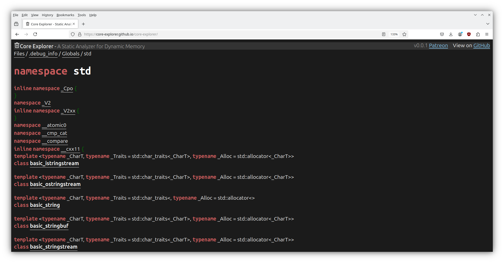
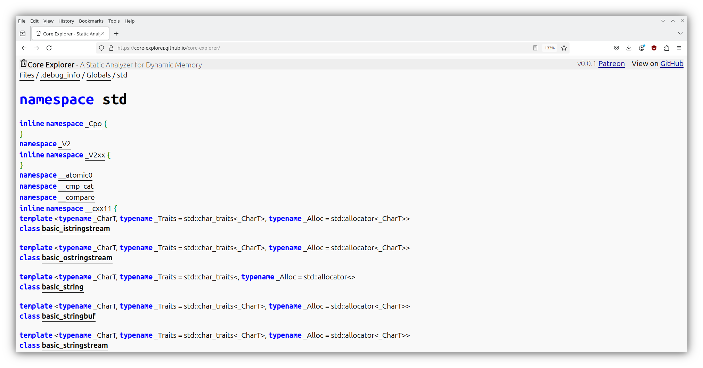
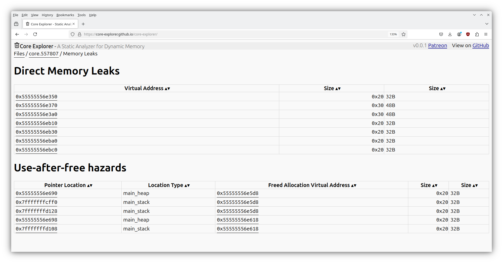

### Core Explorer ###

Core Explorer is a core dump analyzer.

A core dump analyzer is like a debugger that can only open core dumps.
It has no state, no commands. **You can make no mistakes.** [Try it now](https://core-explorer.github.io/core-explorer)

It presents files, types, objects, and the relationships between them.

Features:
* ELF parser for executables, shared libraries and core dumps.
* DWARF parser for debug information. Presents files, namespaces, types and variables in a manner similar to doxygen.
* supports the debuginfod protocol to download debug information
* Coredump parser: 
    * identify all C++ objects in memory that possess virtual methods. This works even for stripped binaries.
    * identify all allocations allocated or freed by glibc malloc. This requires debug information for the C library and ld.so
    * identify memory leaks and references into freed allocations (temporarily not exposed in UI until refactoring is complete)
    * unwind the stack for all threads and display local variables and function parameters. Requires unwind information in the Itanium ABI, does not support compact unwind information used by 32-bit ARM.

Work in progress:
* find the shortest possible name for C++ types and functions
* using debug information, recursively follow all pointers in identified objects on the stack, heap, global variables and thread local storage
* search and queries

Limitations:
* Platform dependent features have only been implemented for x86-64 and aarch64.
* Only tested with user space applications and only on Linux, support for FreeBSD is in progress.
* If you run this in your web browser, you are limited to 2GB total memory.
* It does not have progress bars.

I have created a selection of core dumps with various problems:
*  [Invalid pointer derefence](https://core-explorer.github.io/core-explorer/index-st.html?download=https://core-explorer.github.io/binary-samples/cpp-examples/x86_64-Debug-bookworm/PointerExample.gdb.core&download1=https://core-explorer.github.io/binary-samples/cpp-examples/x86_64-Debug-bookworm/PointerExample)
* [Calling a virtual function from a base class](https://core-explorer.github.io/core-explorer/index-st.html?download=https://core-explorer.github.io/binary-samples/cpp-examples/x86_64-Debug-noble/VirtualExample.gdb.core&download1=https://core-explorer.github.io/binary-samples/cpp-examples/x86_64-Debug-noble/VirtualExample)
* [leaking memory](https://core-explorer.github.io/core-explorer/index-st.html?download=https://core-explorer.github.io/binary-samples/cpp-examples/x86_64-Debug-bookworm-clang/NewExample.gdb.core&download1=https://core-explorer.github.io/binary-samples/cpp-examples/x86_64-Debug-bookworm-clang/NewExample)
* [Corrupting malloc metadata](https://core-explorer.github.io/core-explorer/index-st.html?download=https://core-explorer.github.io/binary-samples/cpp-examples/x86_64-Debug-noble/VectorExample.gdb.core&download1=https://core-explorer.github.io/binary-samples/cpp-examples/x86_64-Debug-noble/VectorExample)

## Standalone Application ##

There is also a standalone node.js application [cdx.js](README_cdx.md).

## Important: ##
*Do not leak client data by sharing core dumps.* 

*Do not leak confidential information by sharing debug information.*

Core Explorer runs exclusively in your browser, all uploads happen inside your browser.
Your files are never stored anywhere. Core Explorer does not use tracking, analytics or cookies.
