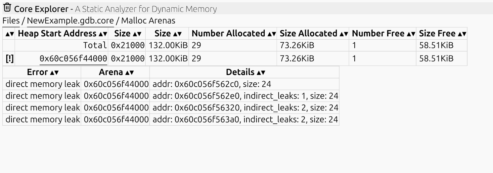

### Core Explorer ###

Core Explorer is a core dump analyzer.

A core dump analyzer is like a debugger that can only open core dumps.
It has no state, no commands. **You can make no mistakes.** [Try it now](https://core-explorer.github.io/core-explorer)

It presents files, types, objects, and the relationships between them.

Features:
* ELF parser for executables, shared libraries and core dumps.
* DWARF parser for debug information. Presents files, namespaces, types and variables in a manner similar to doxygen.
* supports the debuginfod protocol to download debug information
* Coredump parser: 
    * can identify all C++ objects in memory that possess virtual methods. This works even for stripped binaries.
    * can identify all allocations allocated or freed by glibc malloc. This requires debug information for the C library and ld.so
    * can identify memory leaks and references into freed allocations

Work in progress:
* stack unwinder and identify all local variables
* using debug information, recursively follow all pointers in identified objects on the stack, heap, global variables and thread local storage
* search and queries

Limitations:
* Platform dependent features have only been implemented for x86-64 and aarch64
* Only tested with user space applications and only on Linux.
* If you run this in your web browser, you are limited to 2GB total memory
* It needs progress bars

If you don't have a linux core dump available, I put one into the [example](example) folder

Try it with [example core dump](https://core-explorer.github.io/core-explorer?download=https://core-explorer.github.io/core-explorer/example/core.3394593&download1=https://core-explorer.github.io/core-explorer/example/dummy_O2_zrelro_g_fPIE&download2=https://core-explorer.github.io/core-explorer/example/libshared_O2_zrelro_g.so)

## Important: ##
*Do not leak client data by sharing core dumps.* 

*Do not leak confidential information by sharing debug information.*

Core Explorer runs exclusively in your browser, all uploads happen inside your browser.
Your files are never stored anywhere. Core Explorer does not use tracking, analytics or cookies.
