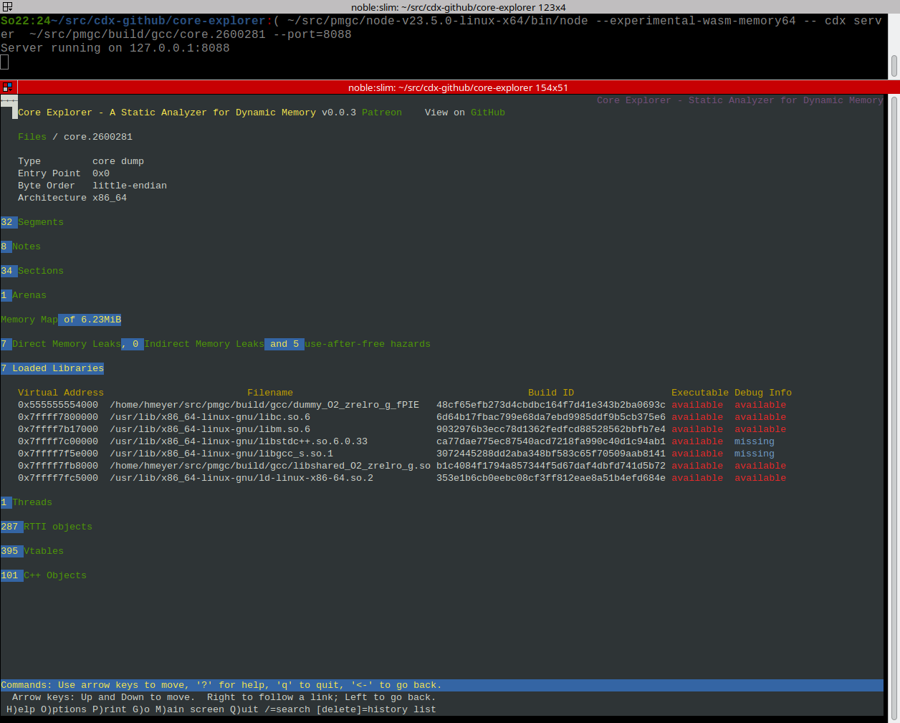
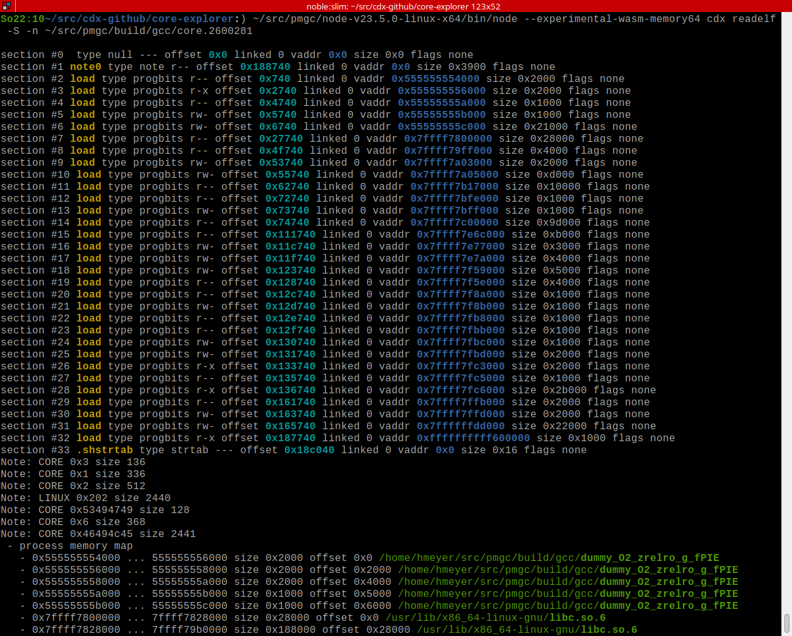

## cdx.js ##

[cdx.js](cdx.js) is a self-contained command-line application that provides a dedicated server for Core Explorer.

You use it like this
`node cdx server inputfile1 inputfile2 ...`

If you have a sysroot, you can specify it as 

`node cdx server inputfile1 inputfile2 --sysroot /path/to/sysroot`

Unlike the web application hosted at https://core-explorer.github.io/core-explorer it is not possible to add additional files after startup.

By default, it opens a local webserver on 127.0.0.1 port 8086. The port can be changed with `--port`
When used via cdx.js, the web UI does not require JavaScript and is fully compatible with text mode browsers:

Requirements:
- node.js version 23.0.0 or newer
- there are no other dependencies

## Command line operation ##

There are other operating modes besides `server`:
- `cdx analyze` implements the object enumeration and error checking of Core Explorer
- by defaualt it will display all objects it could identify in a core dump. Use `--count` to only show object counts instead of individial object addresses. USe `--check` to no show objects and only show detected problems.

There are some more operating modes similar to existing tools:
- `cdx readelf` behaves similar to readelf and eu-readelf. This is used to test the ELF parser and DWARF parser against those tools.  Use `--format=elfutils` or `--format=binutils` to get the same output (except colored) as these implementations.
- `cdx ldd` behaves similar to libtree and other utilities that simulate ldd. ldd is a shell script which runs the dynamic loader specified in an executable, which may pose a security risk when a malicious binary replaces the default loader.
Eventually, the Core Explorer web UI will use this information to highlight shared libraries that are not load-time dependencies and have therefore been dynamically loaded with `dlopen()`
- `cdx srcfiles` behaves similar to eu-srcfiles from elfutils
- `cdx stack` shows the stack traces of all threads in a coredump similiar to eu-stack from elfutils.

The list of tools can be obtained with `cdx --help`. Each tool has independent options, which can be seen with, e.g. `cdx analyze --help`

## Important: ##
*Do not leak client data by sharing core dumps.* 

*Do not leak confidential information by sharing debug information.*

cdx.js runs locally. Your files are never copied or uploaded anywhere. cdx.js does not use tracking, analytics or cookies (except to signal dark mode preferences to the locally running server, there are some server-generated colors).

